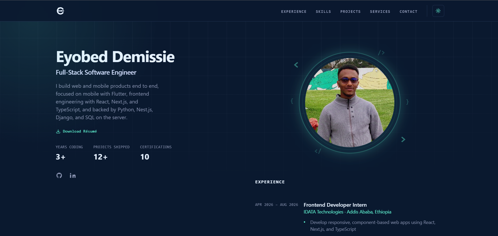
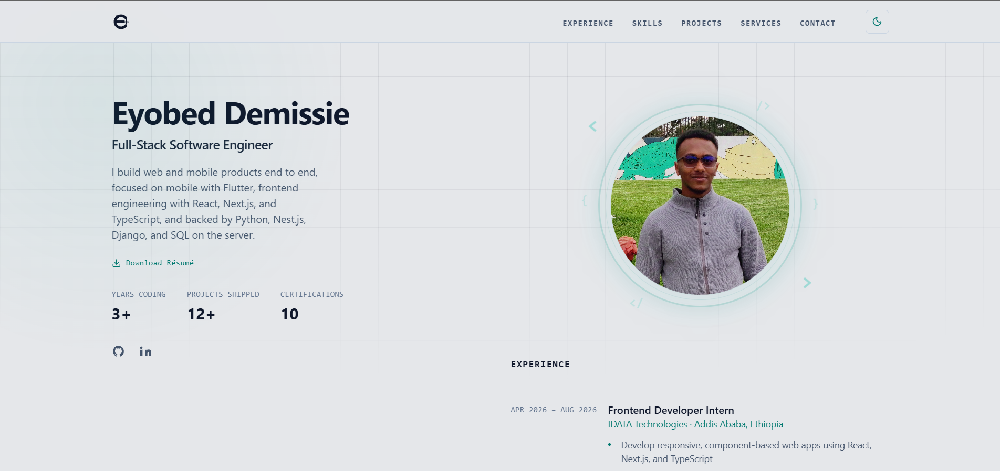

# Eyobed Demissie · Portfolio

A modern, responsive developer portfolio built with React, TypeScript, and Tailwind CSS. Features a clean, premium design with smooth animations, dark/light theme support, and a single-page layout showcasing experience, skills, projects, and certifications.

## 🌐 Live Demo

- 🔗 [Portfolio](https://eyobeddemissie.pro.et)
- 🔗 [GitHub](https://github.com/Eyobed9/Portfolio)

---

## 🧰 Tech Stack

### 🖥️ Frontend
- React 19
- TypeScript
- Tailwind CSS + DaisyUI
- Vite

### 🎨 UI / UX
- Lucide Icons
- Custom animations & transitions
- Glassmorphism elements
- Dark / Light theme toggle

### 📦 Tooling
- ESLint + Prettier
- Husky (Git hooks)
- ReportLab (resume PDF generation)

---

## 📂 Project Structure

```
src/
├── animations/       # Animation utilities
├── assets/           # Images, hero photo, project thumbnails
├── components/
│   ├── forms/        # Contact form components
│   └── ui/           # Reusable UI primitives (Header, Footer, etc.)
├── config/           # Theme palette, section config
├── context/          # React context providers (theme, language)
├── data/             # Static data (projects, skills, about)
├── hooks/            # Custom React hooks
├── i18n/             # Translation utilities
├── layouts/          # Page layout wrappers
├── locales/          # Locale JSON files
├── pages/            # Page-level components
├── routes/           # Routing configuration
├── types/            # TypeScript type definitions
└── utils/            # Helper utilities

docs/
└── generate_resume.py   # Python script to regenerate the PDF résumé

public/
├── certifications/      # Certificate images and PDFs
└── Eyobed-Demissie-Resume.pdf
```

---

## ⚙️ Installation & Setup

### 🔧 Prerequisites

- Node.js 18+
- npm, yarn, pnpm, or bun

### 💻 Setup

```bash
git clone https://github.com/Eyobed9/portfolio.git
cd portfolio
npm install
npm run dev
```

Open [http://localhost:5173](http://localhost:5173) in your browser.

### 📄 Regenerate Resume PDF

```bash
pip install reportlab
python docs/generate_resume.py
```

---

## 🔐 Environment Variables

Create a `.env` file in the project root:

```
VITE_EMAILJS_SERVICE_ID=your_service_id
VITE_EMAILJS_TEMPLATE_ID=your_template_id
VITE_EMAILJS_PUBLIC_KEY=your_public_key
```

---

## 🚀 Features

- 🎨 **Dark / Light Theme** with smooth transitions
- 📱 **Fully Responsive** mobile-first design
- 🧑‍💻 **Experience Timeline** with role highlights
- 🎓 **Education & Certifications** with inline certificate viewer
- 🛠️ **Skills Grid** with category filters and GitHub-style language bar
- 📁 **Project Showcase** with category filters and thumbnail previews
- 💼 **Services Section** highlighting key offerings
- 📬 **Contact Form** powered by EmailJS
- 📥 **Downloadable Résumé** auto-generated via Python
- ⚡ **Smooth Scroll Animations** and micro-interactions

---

## 📸 Screenshots

| Dark Mode | Light Mode |
|-----------|------------|
| |  |


---

## 👏 Contributing

Contributions are welcome! Please fork the repo and open a pull request.

```bash
git clone https://github.com/Eyobed9/portfolio.git
git checkout -b feature/feature-name
```

---

## 📬 Contact

For questions, reach out at [eyobedteshome@gmail.com](mailto:eyobedteshome@gmail.com) or connect via [LinkedIn](https://www.linkedin.com/in/eyobed-d-249634230/).

---

## 🙏 Acknowledgments

- [React](https://react.dev/)
- [Vite](https://vite.dev/)
- [Tailwind CSS](https://tailwindcss.com/)
- [Lucide Icons](https://lucide.dev/)
- [DaisyUI](https://daisyui.com/)
